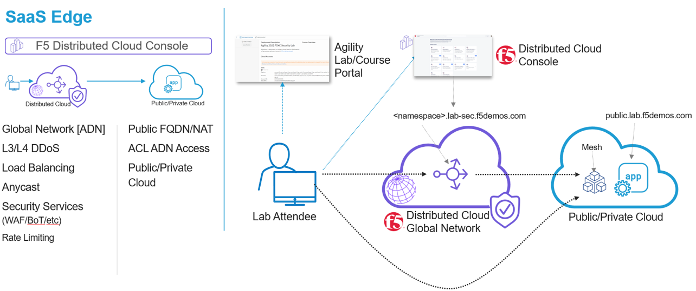

Introduction: Accessing F5 Distributed Cloud Console
####################
Welcome to this F5 Distributed Cloud Lab. The following tasks will guide you through the initial access requirements for this multi-part lab. Lab attendees should have received an invitation email to the lab environment based on the submitted registration email. Please check email and spam folders if it has not been received. If you have not received an email, please contact a member of the lab team.

F5 Distributed Cloud Console where this lab will be conducted, is a SaaS control-plane for services that provides a UI and API for managing network, security, and compute services. The F5 Distributed Cloud Console can manage "sites" in existing on-premises data centers and sites in AWS, Azure, and GCP cloud environments.

Task 1: Lab Environment
####################
The image below represents an overview of the lab environment. F5 Distributed Cloud Services will be configured as a SaaS Edge delivery and security service tier to a publicly hosted web application. Key elements lab attendees will interact with are as follows:

- F5 Distributed Cloud Console
- F5 Distributed Cloud Global Network / Application Delivery Network (ADN)
- Publicly hosted application (Public Cloud)

